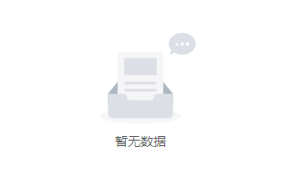
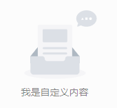
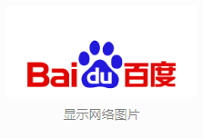
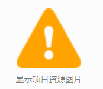

# 1. 前言

在日常开发中，页面上肯定有展示数据的需求，但是当某些时候该展示数据的地方此时数据为空时，就会留下一片空白，对用户体验不是很好，那么接下来我们就封装一个空数据时的占位展示图，告诉用户此时用户为空，并非数据没有加载出来，不用让用户盲目的等待。

# 2. 使用示例

该组件可以直接引入到项目中使用，示例如下：

```vue
<template>
  <div id="app">
    <div v-if="content.length"></div>  
    <Empty v-else></Empty>
  </div>
  </div>
</template>

<script>
import Empty from './Empty'
export default {
  name: 'app',
  components: { Empty},
  data() {
    return {
      content:[]
    }
  }
}
</script>
```

在上面代码中，假设你需要展示的内容是`content`，那么你就可以判断当内容有值时展示内容，当内容为空时展示空数据时的占位展示图。效果如下：

# 3. 组件可选属性

该组件除了可以直接使用外，还提供过了一些可选属性供个性化配置，提供可选属性如下：

|  属性名称   |         描述         |  类型  | 是否必须 |  默认值  |
| :---------: | :------------------: | :----: | :------: | :------: |
| description |    自定义描述内容    | String |    否    | 暂无数据 |
|    image    | 自定义显示图片的路径 | String |    否    | 默认图片 |
| imageStyle  | 自定义显示图片的样式 | Object |    否    |    -     |

组件提供了3个可选属性，你可以这样去使用它们：

- 自定义描述内容

  ```html
  <Empty description="我是自定义内容"></Empty>
  ```

- 显示自定义图片

  ```html
  <Empty description="显示网络图片" image="https://www.baidu.com/img/bd_logo1.png"></Empty>
  ```
  
  
  

  ```javascript
  <Empty description="显示项目资源图片" :image="require('@/assets/images/warn.png')"></Empty>
  ```
  

- 自定义显示图片样式

  ```html
  <template>
      <Empty 
         description="显示网络图片" 
         image="https://www.baidu.com/img/bd_logo1.png" 
         :imageStyle="imageStyle">
      </Empty>
  </template>
  <script>
      data() {
          return {
            imageStyle:{
              width:'10px'
            }
      }
  </script>
  ```

# 4. 组件代码

完整代码请戳☞[Vue-Components-Library/Empty](https://github.com/NLRX/Vue-Components-Library/tree/master/Empty)

（完）

